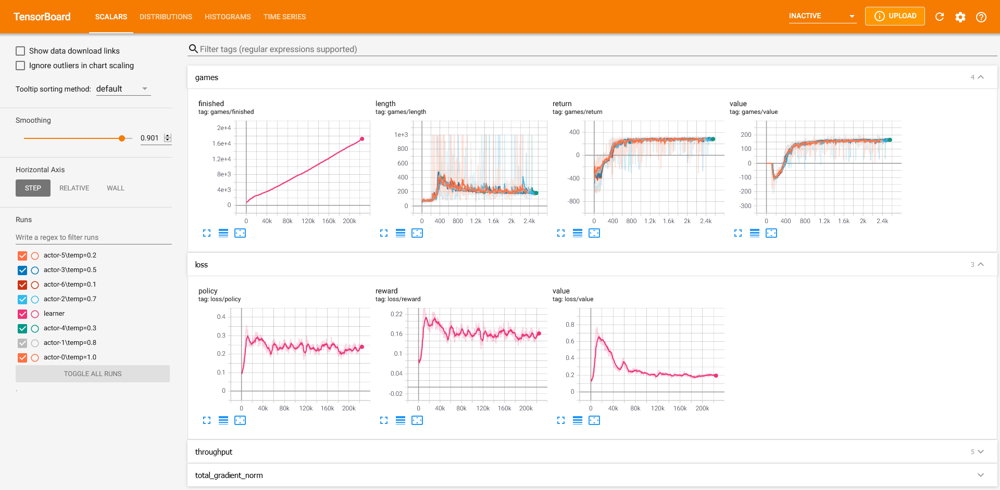
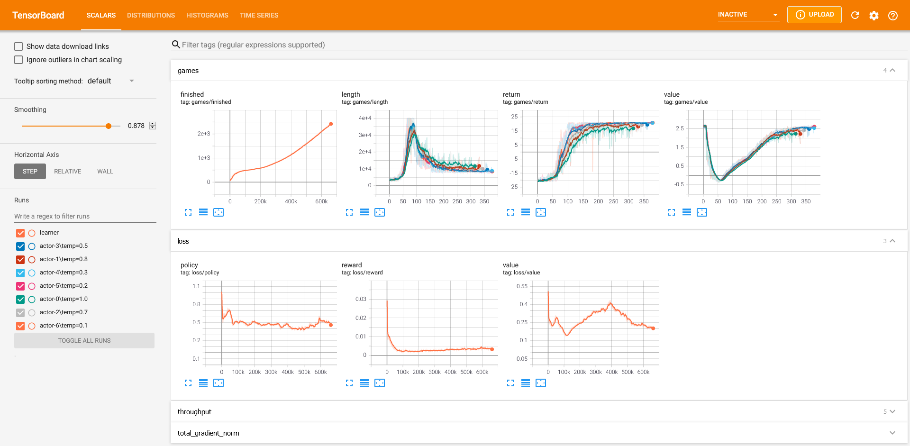

# model-based-rl
A PyTorch implementation of MuZero from [Mastering Atari, Go, Chess and Shogi by Planning with a Learned Model](https://arxiv.org/pdf/1911.08265.pdf), which is mainly used for fun and testing ideas.

_This implementation currently only supports one-player games._

## Examples

### LunarLander-v2

Random            |  Trained
:-------------------------:|:-------------------------:
  |  

- Training results



---

### Pong-ramNoFrameskip-v4

Random            |  Trained
:-------------------------:|:-------------------------:
  |  

- Training results



---

### Breakout-ramNoFrameskip-v4

Random            |  Trained
:-------------------------:|:-------------------------:
 | 

- Training results


---
## Installation:
```bash
git clone https://github.com/JimOhman/model-based-rl.git
cd model-based-rl
pip install -r requirements.txt
```

## Reproduce examples:

* LunarLander-v2: ```python train.py --environment LunarLander-v2 --architecture FCNetwork --log actors learner --num_actors 7 
--fixed_temperatures 1.0 0.8 0.7 0.5 0.3 0.2 0.1 --td_steps 1000 --max_history_length 1000 --group_tag my_group_tag --run_tag my_run_tag```

* Pong-ramNoFrameskip-v4: ```python train.py --environment Pong-ramNoFrameskip-v4 --architecture FCNetwork --log actors learner --num_actors 7 
--fixed_temperatures 1.0 0.8 0.7 0.5 0.3 0.2 0.1 --td_steps 10 --state_range 0 255 --norm_states --sticky_actions 4 --noop_reset --episode_life  --group_tag my_group_tag --run_tag my_run_tag```

* Breakout-ramNoFrameskip-v4: ```python train.py --environment Breakout-ramNoFrameskip-v4 --architecture FCNetwork --log actors learner --num_actors 7 
--fixed_temperatures 1.0 0.8 0.7 0.5 0.3 0.2 0.1 --td_steps 10 --window_size 200000 --batch_size 512 --state_range 0 255 --norm_states --sticky_actions 4 --noop_reset --episode_life --fire_reset --clip_rewards --avoid_repeat  --group_tag my_group_tag --run_tag my_run_tag```

A training run stores training results and checkpoints in auto-generated directories.

See live training results with tensorboard:
```bash
tensorboard --logdir model-based-rl/runs/(environment)/(group_tag)/(run_tag)
```

Evaluate saved networks:
```bash
python evaluate.py --saves_dir model-based-rl/runs/(environment)/(group_tag)/(run_tag)/saves/ --evaluate_nets (eg. 1000, 2000) --render --plot_summary --include_policy
```


## Description of arguments:

|Argument | Description|
|:-------------|:-------------|
|**Network**|
| `--architecture {FCNetwork, MuZeroNetwork, TinyNetwork}` |Name of an implemented network architecture|
| `--value_support` |Min and max of the value support (default: -15 15)|
| `--reward_support` |Min and max of the reward support (default: -15 15)|
| `--no_support` |Turn off support|
| `--seed` |Set the seed for random number generators (default: None)|
|**Environment**|
| `--clip_rewards` |Clip rewards to [-1, 1]|
| `--stack_states` |Stack given amount of consecutive states to a new state (default: 1)|
| `--state_range` |Specify the value range of features for the state, ex. 0 255 (default: None)|
| `--norm_states` |Normalize the states based on the given --state_range|
| `--max_episode_steps` |Override the default max_episode_steps of the environment (default: None)|
| `--sticky_actions` |Apply same action a given amount of times (default: 1)|
| `--episode_life` |Prevent bootstrapping the value after a loss of a life in Atari games|
| `--fire_reset` |Apply the FIRE action after a reset call in Atari games|
| `--noop_reset` |Apply the NOOP action a random amount of times between [0, --noop_max] after a reset call in Atari games|
| `--noop_max` |Change the maximum for --noop_reset (default: 30)|
| `--avoid_repeat` |Adds a 5% chance of random action if no reward is observed for 500 steps|
|**Self-Play**|
| `--num_actors` |Number of self-play actors to launch, ex. num_cpu_cores - 1 (default: 7)|
| `--max_steps` |Maximum amount of steps per game (default: 40000)|
| `--num_simulations` |Amount of MCTS simulations at each step (default: 30)|
| `--max_history_length` |Maximum length of game histories sent to the replay buffer (default: 500)|
| `--visit_softmax_temperatures` |List of policy temperatures to apply throughout training (default: [1.0, 0.5, 0.25])|
| `--visit_softmax_steps` |List of training steps to change to the next temperature in --visit_softmax_temperatures (default: [15000, 30000])|
| `--fixed_temperatures` |List of fixed temperatures to each actor, instead of decaying (default: None)|
| `--root_dirichlet_alpha` |Shape of dirichlet noise added to the root node (default: 0.25)|
| `--root_exploration_fraction` |Fraction of dirichlet noise added to the root node (default: 0.25)|
| `--pb_c_base` |Base value of cpuct in the UCB formula (default: 19652)|
| `--pb_c_init` |Initial value of cpuct in the UCB formula (default: 1.25)|
|**Prioritized Experience Replay**|
| `--window_size` |Max amount of experiences to store (default: 100000)|
| `--window_step` |Step size to increase window size (default: None)|
| `--epsilon` |Lowest possible priority (default: 0.01)|
| `--alpha` |Raise each priority by this power (default: 1.)|
| `--beta` |Use to correct for the sampling bias (default: 1.)|
| `--beta_increment_per_sampling` |Increase the --beta towards 1 each sampling (default: 0.001)|
|**Training**|
| `--training_steps` |Amount of training steps to complete (default: 100000000)|
| `--policy_loss` |Loss function for the policy (default: CrossEntropyLoss)|
| `--scalar_loss` |Loss function for the value and reward function, if support is not used (default: MSE)|
| `--num_unroll_steps` |Amount of consecutive experiences used in one backpropagation (default: 5)|
| `--td_steps` |Time-difference steps to use when calculating value targets (default: 10)|
| `--batch_size` |Amount of samples per batch (default: 256)|
| `--discount` |Discount for the value targets (default: 0.997)|
| `--batches_per_fetch` |Amount of batches to fetch in parallel from the replay buffer (default: 15)|
| `--stored_before_train` |Amount of experiences stored in the replay buffer before the learner starts (default: 50000)|
| `--clip_grad` |Maximum norm of the gradients (default: None)|
| `--no_target_transform` |Turn off value and reward target transforms|
| `--sampling_ratio` |Keep the sampling ratio at the given value by slowing down the learner (default: None)|
| `--send_weights_frequency` |New training steps before updated weights are sent to the shared storage (default: 500)|
| `--weight_sync_frequency` |New experiences before each actor requests updated weights (default: 1000)|
| `--use_q_max` |Use estimated max Q-value as value target instead of MCTS average|
| `--optimizer {SGD, RMSprop, Adam, AdamW}` |Name of implemented optimizer (default: AdamW)|
| `--momentum` |Amount of momentum for optimizers that use it (default: 0.9)|
| `--weight_decay` |Amount of weight decay specified to the optimizer (default: 0.0001)|
| `--lr_scheduler` |Name of the learning rate scheduler (default: None)|
| `--lr_init` |Initial learning rate (default: 0.0008)|
| `--lr_decay_rate` |Decay rate for learning rate scheduler that use it (default: 0.01)|
| `--lr_decay_steps` |Training steps until the lr has been reduced by a factor of --decay_rate (default: 100000)|
|**Saving and Loading**|
| `--save_state_frequency` |Save the learners state with this frequency in terms of training steps (default: 1000)|
| `--load_state` |Load the state of a saved learner with the given path and continues training from there (default: None)|
| `--override_loaded_config` |Override the config in the loaded state with the current config|
|**Evalutation**|
| `--saves_dir ` |Path to the saves directory which stores the learner states (required)|
| `--evaluate_nets` |Names of learner states in the given saves directory to compare between (required)|
| `--games_per_evaluation` |Number of games to evaluate state on. (default: 1)|
| `--plot_summary` |Plot metrics of the games played such as return, predicted value, etc.|
| `--include_policy` |Include the networks policy in --plot_summary|
| `--include_bounds` |Include standard deviation bounds in --plot_summary if multiple games are played|
| `--detailed_label` |Add more information to the legend in the plot|
| `--smooth` |Smoothen metrics in --plot_summary for better visualization (default: 0)|
| `--apply_mcts_steps` |Apply a given amount of steps from each MCTS (default: 1)|
| `--parallel` |Evaluate multiple games in parallel by the use of Ray|
| `--render` |Render the games during evaluation|
| `--save_gif_as` |Save a gif of a rendered game as the given name|
| `--sleep` |Use to slow down the rendering, given in seconds (default: 0)|
| `--save_mcts` |Save a visualization of the mcts during each step of the game|
| `--save_mcts_after_step` |Modify the step after --save_mcts should start|
| `--eval_temperatures` |List of temperatures to compare between in evaluation (default: None)|
| `--only_prior {0, 1}` |Set as 1 to only use the networks prior to play (default: 0)|
| `--only_value {0, 1}` |Set as 1 to only use networks value function to play (default: 0)|
| `--use_exploration_noise {0, 1}` |Set to 1 to include dirichlet noise during evaluation (default: 0)|
|**Logging**|
| `--log {actors, learner}` |Specify actors or learner or both to log training results into tensorboard. (default: None)|
| `--group_tag ` |An optional tag used to group training runs, used mainly for tensorboard (default: default)|
| `--run_tag ` |A tag specifying the training run, used mainly for tensorboard (default: auto-generated)|
|**Debugging**|
| `--debug ` |Include weight distributions per training step in tensorboard when --log learner is given|
| `--verbose {actors, learner}` |Print info about loss and game results during training (default: None)|
